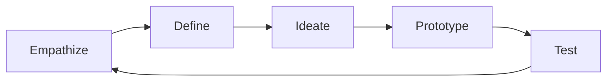

Design thinking is a non-linear, iterative process for creative problem-solving that puts humans at the center. Maya's workflow guides you through all five phases.

## The Five Phases Overview

Design thinking progresses through empathy, definition, ideation, prototyping, and testing:

The process is iterative—testing often reveals new empathy needs, restarting the cycle.

## Phase 1: Empathize

**Goal:** Understand the people you're designing for.

The empathy phase builds deep understanding of user needs, behaviors, attitudes, and contexts. Without this foundation, solutions solve the wrong problems.

| Activity | Purpose |
| ---------- | ------- |
| **User interviews** | Hear directly from users in their own words |
| **Observation** | Watch what people actually do, not what they say |
| **Empathy mapping** | Organize observations into what users think, feel, see, do |
| **Journey mapping** | Map the complete user experience over time |

:::tip[Maya's Emphasis]
Maya consistently redirects to "THEM not us"—design with users, not for them. Validation through real human interaction beats every assumption.
:::

## Phase 2: Define

**Goal:** Frame a user-centered problem statement.

The define phase synthesizes empathy research into a clear, actionable problem statement. A good definition guides ideation without constraining it.

| Output | Description |
| ------- | ----------- |
| **Point of View (POV)** | User-centered problem statement |
| **How Might We (HMW) questions** | Reframe problems as opportunities |
| **Problem statements** | Clear articulation of what needs solving |

**Example POV:**
"Busy parents need a way to feel connected to their children's education because current communication is scattered and time-consuming."

## Phase 3: Ideate

**Goal:** Generate a wide range of solutions.

The ideate phase creates quantity and diversity of options. Divergent thinking here prevents converging on the first obvious solution.

| Approach | How It Works |
| ---------- | ------------ |
| **Brainstorming** | Generate many ideas rapidly |
| **Sketching** | Visual thinking explores beyond words |
| **Storyboards** | Narrative exploration of user experience |
| **Worst ideas** | Flip to reverse constraints |

Maya emphasizes: diverge before converging. Generate 50+ ideas before evaluating any.

## Phase 4: Prototype

**Goal:** Make ideas tangible and testable.

Prototypes are rough representations that communicate the essence of an idea. They're not about polish—they're about learning.

| Fidelity | When to Use |
| -------- | ----------- |
| **Paper sketches** | Early exploration, quick iterations |
| **Wireframes** | Structure and layout, low-detail |
| **Click-throughs** | Interaction flow without visuals |
| **Wizard of Oz** | Manual simulation of digital features |

:::caution[Prototype to Learn]
Don't build to impress—build to learn. A paper prototype tested today beats a perfect prototype built too late.
:::

## Phase 5: Test

**Goal:** Validate solutions with real users.

Testing reveals whether prototypes solve the real problem. Negative results are valuable learning—they save building the wrong thing.

| Activity | Purpose |
| ---------- | ------- |
| **Usability testing** | Observe users interacting with prototype |
| **Feedback capture** | Hear what works and what doesn't |
| **Assumption validation** | Confirm or refute design hypotheses |
| **Iteration planning** | Identify what to change next |

## Non-Linear Progress

Design thinking looks linear but rarely proceeds in a straight line:

| Common Pattern | What Happens |
| -------------- | ------------- |
| **Test reveals empathy gaps** | Back to Phase 1 for deeper understanding |
| **Ideate produces weak concepts** | Back to Phase 2 for better framing |
| **Prototype uncovers new insights** | Back to Phase 1 or 2 with fresh perspective |

Maya guides this non-linear journey, recognizing that each phase informs all others.

## Design Thinking vs. Other Approaches

| Aspect | Design Thinking | Traditional Product Development |
| ------- | --------------- | ------------------------------- |
| **Starting point** | User needs and context | Business requirements or technology |
| **Process** | Iterative, non-linear | Linear, gated |
| **Risk** | Fail fast, learn early | Fail late, expensive |
| **Output** | User-validated solutions | Feature-complete products |

## When Design Thinking Works Best

| Situation | Why Design Thinking Helps |
| ----------- | ------------------------- |
| **New product development** | Ensures product-market fit |
| **Complex user experiences** | Maps complete journeys, not touchpoints |
| **Cross-functional alignment** | Shared empathy builds team consensus |
| **Innovation opportunities** | Uncovers unmet needs not obvious from data |

## Next Steps

- **[Apply design thinking](/how-to/design-thinking.md)** — Run a design thinking session with Maya
- **[Learn brainstorming techniques](/explanation/brainstorming-techniques.md)** — Support ideation with structured methods
